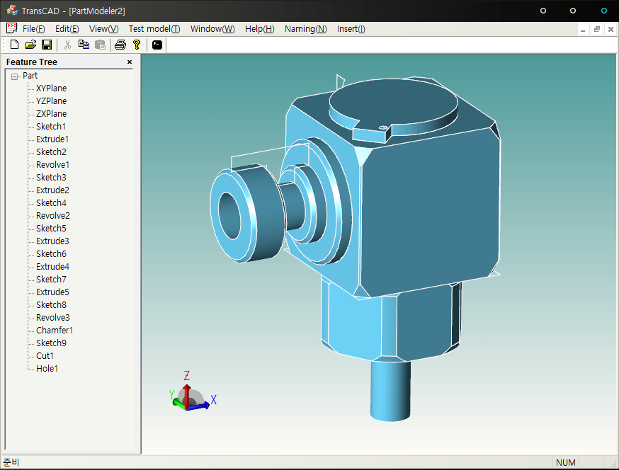

# TransCAD

TransCAD is a 3D CAD model translator with MPA(Macro parametrics approach) between commercial CAD systems.

MPA is a methodology of exchange of model data between CAD systems using macro file, wich is modeling commands set of each commercial CAD system.

* [MPA homepage](http://macro-parametrics.org/)
* [TransCAD Git repository](https://github.com/Macro-parametrics/TransCAD)

# Compiling
Development Environment
>OS: Windows  
>Compilier: Visual Studio 2010  
>Language: C++  

Compiling TransCAD requires ACIS and HOOPS of SPATIAL.
ACIS and HOOPS are a commercial library. However, if you are students or educators in university, you can use ACIS and HOOPS freely.

In this section, we assume that you already have ACIS and HOOPS license.
To compile TransCAD, you should use specific version of ACIS and HOOPS.
* ACIS : version R25
* HOOPS : version 1919

Step 1.  
Download ACIS and HOOPS library and extract them

Step 2.  
Add environment variables
1. ACIS  
Variable name: A3DT  
Variable location: yourPath\acisR25

2. HOOPS  
Variable name: HOOPS_INSTALL_DIR  
Variable location: yourPath\HOOPS-1919_VS_2010

Step 3.  
Add variable locations to Path  
1. ACIS  
>%A3DT%\NT_VC_DLL\code\bin  
>%A3DT%\NT_VC12_DLLD\code\bin

2. HOOPS  
>%HOOPS_INSTALL_DIR%\bin\nt_i386_vc12  
>%HOOPS_INSTALL_DIR%\bin\nt_i386_vc12d

Step 4.
Download an additional files
* [Download here](https://www.dropbox.com/s/3rrcqhpub5a05as/RegBin.7z?dl=0)

Extract to TransCAD source code folder  
The folder structure is shown below.  
>TransCAD
>>-RegBin  
>>-Src  
>>-TransCAD.sln  

Step 5.
Building TransCAD
